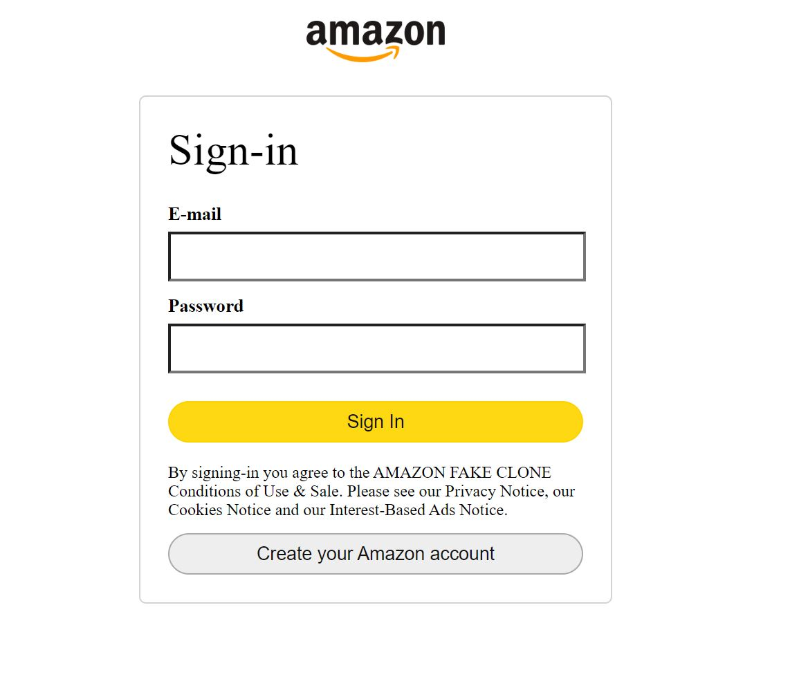
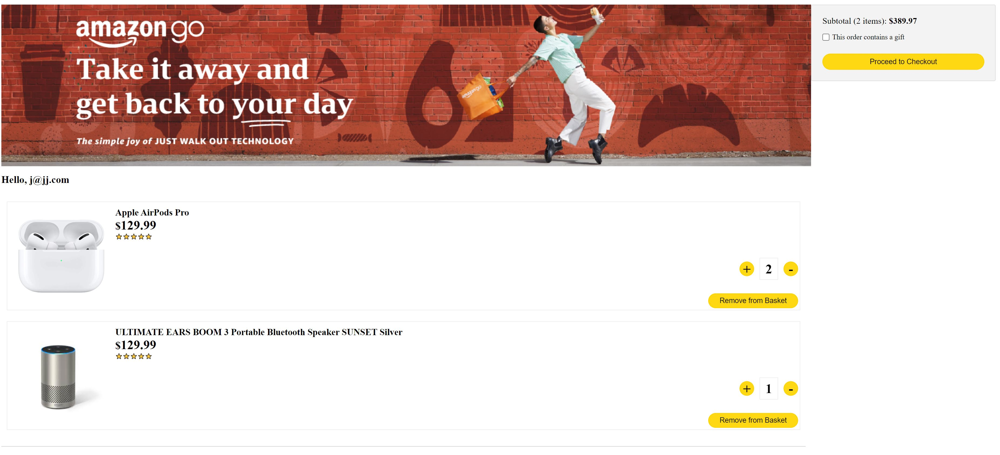
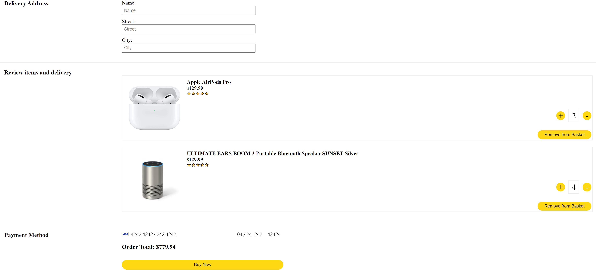
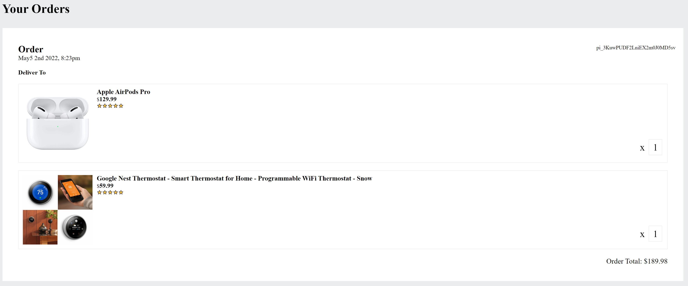

# Amazon-Clone

Amazon Clone is an e-commerce web app allowing users to add items to shopping cart and make payment, order history will then be displayed. [Live Link](https://clone-591e6.web.app/)

## Description

The original idea was from many of those YouTube videos.
The purpose of this project is to practice and enhance my front-end development skills, especially react, as well as
to know more about firebase authentication and firebase database.

## Relevant Techs

### Front-End:

- React
- React Context and React Router
- Sass

### Back-End:

- node.js
- firebase functions

### Tools:

- firebase auth and firestore
- Stripe API for payment
- GitHub actions CI/CD

## Key Features

- Authentication

  

- Smooth item amount adjustment with CSSTransition Component

  

- Payment gateway (test card number: 4242 4242 4242 4242 exp: 04/24 cvv: 242 post: 42424) Please login before you pay!

  

- Order history page

  

## Challenges

- The hard part of this project is to implement payment gateway, need to figure out the relation between payment intent and client secret

- Achieving nice looking transition effect may be difficult in React, I used CSSTransition group to wrap the cart list, one thing that needs to make sure is to provide unique key for each item otherwise the transition effect would not work properly
